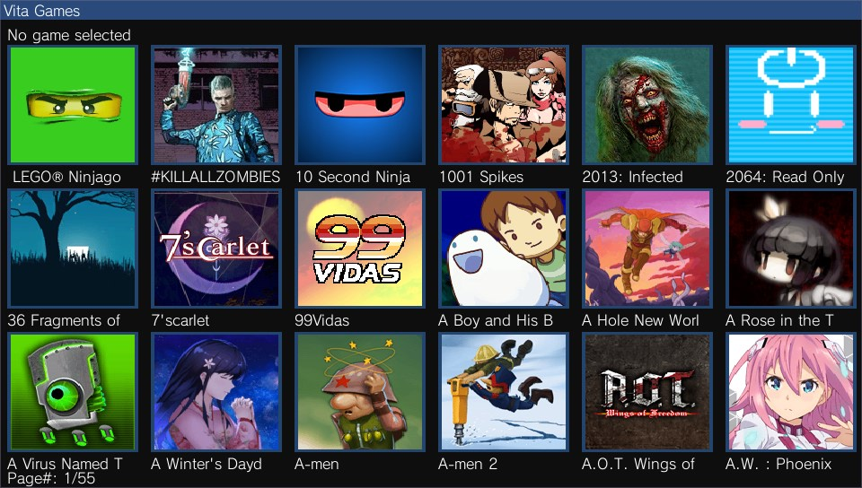

# vita-launcher

Support Forum:
https://gbatemp.net/threads/release-vita-launcher-v1-6-app-to-launch-games-and-apps.574644/

This is an app/game launcher application.

The main purpose of this app is for users who have hundreds of games on their vita.

The PS Vita has a limitation of 500 bubbles only. I couldn't find an app that served me well
to manage my library of games so I decided to create my own.

Use in conjuction with the CopyIcons app to get icons not created by PS Vita: https://github.com/cy33hc/copyicons

## Features

1. Games are grouped into multiple categories (Vita/PSP/Homebrew/Favorites) including retro consoles like NES, SNES, GB, GBC, GBA, N64, etc..
2. Can launch all vita games, Adrenaline bubbles, and retro games without bubbles.
3. Has parental controls for hiding certain settings.
4. Customizable categories via configuration file.
3. Favorites: With hundreds of games, it takes a quite a while to browse all the pages to find your favorite game. With Favorites, I've implemented a feature to add a game to your favorites for easy access.
4. Game images load on demand: With hundreds of games, we can't possibly load all the game images into memory. Images are loaded on demand only and a few pages of images are cached.
5. Last but not least, you can access your full library of games/apps. Just an FYI, I was able to load 1600 games/apps on my PlayStation TV.

## Controls

- up/down/left/right - for browsing your games 
- left analog stick - for browsing your games
- square - add the selected game to favorites
- circle - un-select or back.
- triangle - display settings dialog.
- cross - start the selected game/app
- L-trigger - previous page
- R-trigger - next page
- Select - Toogle multi selection
- Start - display the search dialog

## How to Guides
1. How to change parental controls: https://youtu.be/bq6ZggMmocc
2. How to customize the category where bubble goes into: https://youtu.be/lNG8ox7cj4A
3. How to import ROMs into the launcher: https://youtu.be/hsADyvClBC4
4. How to change the retro core used to start a retro game: https://youtu.be/G49xqrjOcNY
5. How to customize icons for the ROM that displays in the app: https://youtu.be/TRvWKSKki3Q
6. How to setup application to Boot Adrenaline PSP ISO and EBOOT directly without bubbles: https://youtu.be/wkubbIsd8DY
7. How to create folders: https://youtu.be/hVtAYvVsc-c
8. How to play Retro games from FTP server: https://youtu.be/KmcWeG1qImk
9. How to play PSP ISO and EBOOT from FTP server: https://youtu.be/Id-S5U_ZbJY
   
## Build
To build this app, you will need to build the dependency imgui-vita2d (https://github.com/cy33hc/imgui-vita2d).

## Credits
1. Borrowed some audio code from ELEVENMPV
2. Borrowed some code from VitaShell for the ime_dialog and net download
